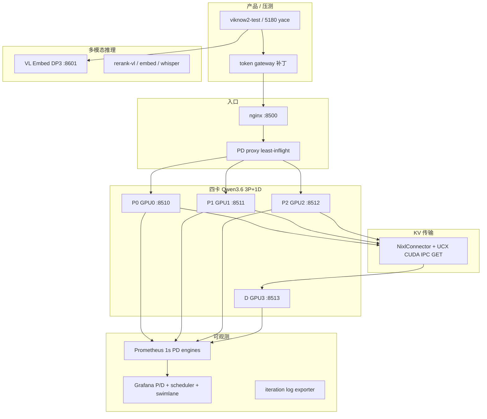

# ViKnow / Qwen3.6 推理优化工作总览（PPT 素材）

> 整理自 236 实验环境与 `viknow-cloud-agent-bridge` 分支文档（`services/qwen36-vllm-pd/`、`loadtests/workload-b-vs-sf/`、`grafana/` 等）。  
> 对外主入口仍为 **`127.0.0.1:8500`**（ViKnow 经 nginx/网关接入）；压测口径为 **Workload B**：约 3.3 万输入 token、184 输出 token、共享长前缀 + 独特尾巴、thinking 关闭。

---

## 1. 我们要解决什么

| 维度 | 初始痛点 | 优化目标 |
|------|----------|----------|
| **时延** | 高并发下 E2E 从数秒涨到数十秒 | 在固定四卡上抬高成功 QPS、压低 B  workload 中位时延 |
| **瓶颈定位** | 不清楚是排队、预填充、decode 还是跨卡 KV | 用引擎指标 + 压测 + Grafana 把瓶颈钉死 |
| **PD 分离** | 混跑 DP4 时 P/D 抢同卡一步预算 | 预填充与出词分卡，NIXL 传 KV |
| **可观测** | P 调度面板「空」、scrape 太稀 | 1s 采样、running/waiting 峰值、P/D 分栏 |
| **多模态栈** | 三路 VL Embedding 三进程三端口 | 合并 DP3，监控与 Prometheus 对齐单实例 |
| **产品接入** | 5180 压测网关模型名与 vLLM served name 不一致 | 网关补丁，直连 8500 可压测 |

---

## 2. 工作地图（按层次）

---

## 3. 基线：四卡混跑 DP4（改 PD 之前）

**配置要点**：`--max-num-batched-tokens 16384`，每步仅 1 条长预填充，MTP 投机解码，prefix caching ~39%。

**Workload B 实测**（`RESULTS_LOCAL.md` / `ANALYSIS_E2E.md`）：

| 并发 | 成功 QPS | 中位 E2E | 要点 |
|------|----------|----------|------|
| 1 | 0.31 | 3.1s | 单条已含长预填充 |
| 8 | 0.84 | 9.6s | 门口排队可忽略 |
| 32 | 1.26 | 25.8s | 槽位满，生成 token/s/条骤降 |
| 80 | 1.62 | 50.2s | 功率仅 ×1.7，吞吐近顶 |

**结论（可放 PPT 一页）**：

- 变慢 **不是** 门口排队（最多约占中位 **3.4%**），而是 **一步 16384 token 预算** 被 ~1.8 万 token 的现场预填充占满，同卡 decode 被饿死。
- 并发 ×80、吞吐只 ×5.2 → **Little 定律** 下的正常饱和，不是偶发长尾。

---

## 4. 架构演进

### 4.1 两路 1P+1D（GPU 0–3）

- **拓扑**：A 路 P0+D1，B 路 P2+D3；`:8500` nginx `least_conn`。
- **相对 DP4**：c1/c8 **QPS +24%～38%**，中位 **~0.7×～0.83×**；c80 略差（仅两张 P 卡扛预填充）。
- **新瓶颈**：出词侧大量 `WAITING_FOR_REMOTE_KVS`，单次 NIXL 拉 **~246MB** KV；无争用墙钟带宽约 **330MB/s**（UCX 走 tcp/sysv 软件路径）。

### 4.2 3P+1D（现网主路径）

- **拓扑**：GPU **0/1/2 预填充**（`:8510–8512`），GPU **3 出词**（`:8513`）；代理 **least-inflight** 选 P。
- **关键工程**：四卡容器 **互相可见 GPU**（NIXL CUDA IPC）；`sitecustomize.py` 修 UCX AM / 握手线程；回滚脚本 `stop-pd-restore-dp4.sh`。

**相对两路 1P+1D（NIXL 已优化后）Workload B c20**：

| 指标 | 2×1P+1D | **3P+1D** | 变化 |
|------|---------|-----------|------|
| QPS | 2.70 | **3.63** | **+35%** |
| 中位 E2E | 7.43s | **5.36s** | **−28%** |
| P 预填充均值 | 4.36s | **2.56s** | 三路分摊 |
| NIXL | ~10ms | ~13ms | 仍非主因 |

**c20 端到端拆解（引擎直方图，可做单页「火焰图式」说明）**：

| 阶段 | 均值 | 占 ~5.4s 客户端 |
|------|------|-----------------|
| P 排队 | 0.10s | 2% |
| P 预填充 | 2.54s | 47% |
| D decode 184 tok | 2.15s | 40% |
| NIXL | 0.013s | <1% |

---

## 5. NIXL / UCX：从 330MB/s 到「不再是主因」

| 阶段 | 手段 | 典型效果（B workload） |
|------|------|------------------------|
| 基线 | `UCX_TLS=all`，VRAM 走 tcp 系 | c8 中位 **6.8s**，xfer **~2.6s** |
| 去 tcp AM | `ucx_error_handling_mode=none`，`sm,cuda_ipc` | c8 **5.4s**，c32 **17.7s**（仍 sysv GET 模拟） |
| **CUDA IPC GET** | `UCX_CUDA_IPC_ENABLE_GET_ZCOPY=on` | c8 **3.4s** QPS **2.45**；c20 **7.5s** QPS **2.64** |
| 失败路径 | `NixlPushConnector` WRITE | 短请求挂死，已放弃 |

**PPT 一句话**：PD 分离后，优化前半段卡在 **跨卡 KV 墙钟带宽**；打开 CUDA IPC GET 后，NIXL 从 **秒级** 降到 **毫秒级**，瓶颈回到 **P 预填充算力** 与 **单卡 D decode 并发**。

---

## 6. 调度与 batch 调参（P 侧）

| 尝试 | 结果 |
|------|------|
| P `max-num-batched-tokens` **32768** | Waiting 下降，QPS 几乎不变（单卡 token/s 到顶） |
| **65536** + P KV **20GiB** | 与 embed/whisper 共卡可站住；c32 90s：**QPS 2.73**，中位 **8.37s**（相对 10min c32 稳态 **13.5s** 明显改善） |
| 131072 / 更高 GPU util | OOM 或与邻卡上下文冲突 |
| D 仍 **16384** batched | 单 D 在 c20 峰值 ~17 路 decode，decode 均值从 1.2s → 2.1s |

---

## 7. 软件栈：vLLM 0.29 + MTP-1

| 版本 | MTP | B c20 结果 |
|------|-----|------------|
| 0.26 自制 | 开 | **全 500**，D 断言 `SSM can only have one local block` |
| 0.26 | 关 | QPS **3.63**，中位 **5.37s** |
| **0.29 官方** | **MTP-1 开** | QPS **3.64**，中位 **5.24s**，p95 **6.75s**；投机接受率 **~72%** |

**要点**：升级主要解锁 **hybrid + NIXL + MTP** 共存；吞吐仍受 P 预填充限制，MTP 更显著改善 **尾延迟**。

---

## 8. 缓存与路由实验（负向/中性结果也要讲）

| 方案 | 现象 | 决策 |
|------|------|------|
| **LMCache** on P | c20 QPS **0.45**，中位 **40s** | 撤掉；hybrid/GDN 与 MP 路径风险高 |
| **prefix_hash** 粘 P | 38% 命中但 **单 P 扛全部**，QPS **1.26** | 不用作默认 |
| **least-inflight** | 恢复 **3.67 QPS**；曾因 P1 ZMQ 握手线程死掉导致 D 失败 | 默认路由 + **握手重绑补丁** |
| **Mooncake Store** on P | 原版引擎崩溃；补丁后 c20 **3.19 QPS**，external 命中 **~2–4%** | 池子小、B workload 收益有限；现网回 Nixl-only |
| Mooncake c32 ×10min | 中位 **13.5s**，P KV **82–95%** | 长压测暴露 P 排队+预填充主导 |

**PPT 价值**：说明团队用 **同一套 B** 做了完整 **负实验归档**，避免重复踩坑。

---

## 9. 可观测性建设

### 9.1 Grafana · Qwen 3P+1D

- 单 dashboard **P / D 分栏**（`:8510–8512` vs `:8513`），对齐原单实例看板习惯。
- **P 调度**：`max_over_time(...[3s])` + **waiting 总和** + 右轴 QPS（避免 prefill 极短导致 running 恒为 0）。
- **Prometheus PD engines 1s scrape** + sidecar **SIGHUP 热加载**（无需重启容器）。
- **调度队列** 整行移至看板底部，避免遮挡主指标。

### 9.2 调度可视化与迭代级指标

- 交互说明：`docs/vllm-scheduler-viz.html`（一步预算、prefill/decode 混步）。
- **Step swimlane** dashboard + **iteration log exporter**（从 vLLM 日志解析每步 context/gen token，补 Prometheus 没有的 batch 结构）。

### 9.3 Embedding · VL DP3

- 三路 **:8601 / :8611 / :8612** 合并为 **单进程 DP3**（GPU 5/6/7），对外仍 **:8601**。
- 三张 Grafana UID 保留；指标统一 `instance=127.0.0.1:8601`，8611/8612 按 **engine** 看 scheduler/KV。

---

## 10. 多模态与周边推理栈

| 组件 | 优化动作 |
|------|----------|
| **Qwen3-VL-Embedding-2B** | 3 容器 → **1×DP3** `recreate-embed-vl-dp3.sh`；与 `vllm-rerank-vl` DP2 模式一致 |
| **vllm-embed / whisper** | 与 P 卡共 GPU 时约束 P **KV 20GiB**；GPU7 与 text embed 争用需先迁卡或 `ALLOW_GPU7_SHARE` |
| **5180 压测** | `model_gateway` 补丁：同 origin 时直接发 **served model name**，避免 404 与错误回落 |

---

## 11. 对标与经济性（Workload B）

### 11.1 延迟与吞吐（节选）

| 场景 | 自建 :8500 | 硅基流动 | Neolink |
|------|------------|----------|---------|
| c80 成功 QPS | **1.62**（0 失败） | **0.24**（大量 429） | **4.13**（c≥32 大量 500） |
| c80 中位 | **50s**（诚实排队+计算） | 98s（成功样本） | ~2.5s（仅成功） |

### 11.2 成本（卡费 mid 口径，`COST.md`）

- c80：**¥0.0039/成功条** vs 硅基实付 **¥0.0607**（约 **1/15**）。
- 但硅基 **买不到** 1.62 QPS；Neolink 低延迟靠 **拒载（500）** 换队列深度。

### 11.3 长上下文档（~20k token × c32）

自建 **698/698**，QPS **3.70**，中位 **6.30s**；硅基/Neolink 受 API 限流与错误率影响 — 见 `RESULTS_B20K.md` / HTML 报告。

---

## 12. 延伸实验（GPU 4–7，与主栈隔离）

- **MoE backend A/B**（`run-pd-exp-moe-gpu47.sh`）：FP8 MoE 后端扫参。
- **EP collocated vs PD+EP**（`run-pd-exp-ep-gpu4576.sh`）：专家并行与 PD 叠放对比。

（用于 PPT「后续算力布局」页，与现网 0–3 卡 3P+1D 主路径分开讲。）

---

## 13. 关键数字一页纸（建议放结尾）

| 里程碑 | 数字 |
|--------|------|
| DP4 c80 → 3P+1D c20 | 中位 **50s → 5.3s** 量级（不同并发，方向性对比） |
| NIXL 优化后 c8 | **6.8s → 3.4s** |
| 3P+1D B c20 稳态 | **QPS 3.63–3.67**，中位 **~5.3s**，NIXL **<20ms** |
| P batched 65536 + 20GiB KV | c32 短窗中位 **8.37s** |
| MTP @0.29 | 接受率 **~72%**，p95 改善 |
| VL Embed | **3 进程 → 1×DP3**，Prometheus **1 target** |

---

## 14. 结论与建议叙事（给 PPT 收尾）

1. **先量后改**：用 Workload B + 引擎直方图证明，高并发慢在 **batch 预算与预填充**，不是「网关排队」或「NIXL 永远不行」。
2. **PD + 传 KV 优化是阶跃**：3P+1D 与 CUDA IPC GET 带来 **~35% QPS / ~28% 中位** 量级的改善（c20 口径）。
3. **单 D 与单步 16384** 仍是上限：再加并发主要加 **时延**；要更低 p50 需 **限流、更多副本、或减现场 prefill**。
4. **缓存/Store 要匹配 workload**：Mooncake/LMCache 在 B 上未赢；prefix 粘滞会打爆单 P。
5. **可观测与部署同等重要**：1s scrape、scheduler 面板、DP3 看板对齐，支撑后续 30 并发压测与线上排障。
6. **商业化对比要三维**：单价、买得到的 QPS、成功样本时延 — 自建胜在 **高负载成功吞吐成本**，云端胜在 **低并发免运维** 或 **拒载后的低 p50**。

---

## 15. 仓库索引（讲稿备注）

| 路径 | 内容 |
|------|------|
| `services/qwen36-vllm-pd/README.md` | 3P+1D 启动、NIXL、UCX、Mooncake 说明 |
| `loadtests/workload-b-vs-sf/RESULTS_PD.md` | PD 全时间线实测表 |
| `loadtests/workload-b-vs-sf/ANALYSIS_E2E.md` | DP4 并发变慢机理 |
| `loadtests/workload-b-vs-sf/COST.md` | 成本与 TPM 墙 |
| `grafana/README.md` | Qwen PD Grafana |
| `grafana/embed-vl/README.md` | VL DP3 看板 |
| `services/vllm-embed-vl-dp3/` | Embedding 合并脚本 |
| `docs/vllm-scheduler-viz.html` | 调度器科普页 |
| `loadtests/workload-b-vs-sf/report-b-*.html` | 对外展示用图表 |

---

*文档版本：2026-09-28；随 `cursor/embed-vl-dp3-c2ee` / `cursor/pd-scheduler-panels-c2ee` 等分支更新。*
