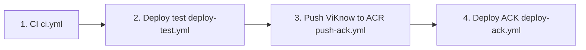

# ViKnow 镜像发布流程（online prod / ACK）

本文整理 **ViKnow 主应用镜像** `viknow2-app` 从代码到 ACK `viknow-app` 命名空间的发布链。事实来源为 Gitea 业务仓 `castmeta-research/viknow2` 的脚本与 `.gitea/workflows`（2026-09 在 236 上核对）。

不包含：Langfuse / Neo4j / ClickHouse 等 **数据栈镜像** 的独立发布（另有 manifest 与 ACR 标签，通常随基础设施变更而非每次应用发版）。

---

## 1. 你要发布的是什么

| 项目 | 说明 |
| --- | --- |
| 镜像名 | `viknow2-app` |
| 本地 tag（runner） | `viknow2-app:<commit_sha 前 12 位>` |
| 推送到 ACR（公网） | `${VIKNOW_ACR_REGISTRY}/${VIKNOW_ACR_NAMESPACE}/viknow2-app:<sha12>` |
| ACK Pod 拉取（VPC） | `${VIKNOW_ACR_PULL_REGISTRY}/${VIKNOW_ACR_NAMESPACE}/viknow2-app:<sha12>` |
| 默认 namespace | `litesense`（与 `deploy/ack/deploy-viknow-app.sh` 默认一致；以 Gitea Variables 为准） |
| 默认 pull 域名 | `registry-vpc.cn-hangzhou.aliyuncs.com` |
| 默认 push 域名 | `registry.cn-hangzhou.aliyuncs.com`（与 ACK 同地域 **cn-hangzhou**） |

Tag **必须** 与本次发布的 **Git commit** 一致（12 位短 SHA）。`scripts/acr_image.py` 统一计算本地/远程镜像名，避免 push 与 deploy 各写一套 tag。

---

## 2. 标准发布链（四步，同一 commit、同一 runner）

所有 ACK 应用发版在 Gitea 上都是 **手动 `workflow_dispatch`**，且依赖 **同一台 runner 上已存在的本地镜像**（`python-312-uv`）。



| 步骤 | Workflow | 作用 |
| --- | --- | --- |
| 1 | `ci.yml` | `ruff` + `pytest` + `uv build` wheel；wheel 存到 runner `/cache/uv/viknow2-artifacts/${GITHUB_SHA}` |
| 2 | `deploy-test.yml` | 用 wheel + `docker buildx bake` 构建 **`viknow2-app:<sha12>`**；部署 test 容器（`:5175`）做冒烟 |
| 3 | `push-ack.yml` | 校验本地镜像存在 → `scripts/push-viknow-acr.sh` **tag 并 push** 到 ACR 公网 |
| 4 | `deploy-ack.yml` | `scripts/deploy-ack-env.sh` → `deploy/ack/deploy-viknow-app.sh` **kubectl apply** Deployment |

**顺序不能乱、不能换 commit：**  
`push-ack` 只 push 当前 checkout 的 `GITHUB_SHA` 对应本地镜像；若跳过 `deploy-test` 或换了分支再点 push，会报 `Local image not found: viknow2-app:<sha12>`。

各 workflow 文件头注释与 `.gitea/repository-config.example.yaml` 中「push-ack 手动发布链」一致。

---

## 3. 每一步在做什么（细节）

### 3.1 CI（`ci.yml`）

- 触发：`main` push / PR / 手动。
- 产出：测试通过 + **wheel 缓存**（供下一步构建 Docker，避免重复 `uv sync`）。
- **不会** 构建 `viknow2-app` 镜像，也不会 push ACR。

### 3.2 Deploy test（`deploy-test.yml`）

- 计算 `VIKNOW_APP_IMAGE=viknow2-app:<sha12>`。
- 若 runner 上尚无该镜像：
  - 从 CI 缓存恢复 `dist/*.whl`；
  - `prepare-docker-build-context.py` + `docker buildx bake`（`docker/docker-bake.hcl` 的 `app` target）；
  - 构建结果 **load 进本地 Docker**（`type=docker`）。
- 运行 `scripts/deploy-test-env.sh`，在 test 环境验证（容器名等见 workflow 内 `VIKNOW_TEST_*`）。
- 成功后 runner 上应能 `docker image inspect viknow2-app:<sha12>`。

### 3.3 Push ViKnow to ACR（`push-ack.yml`）

- 校验 Gitea **Variables / Secrets**：`VIKNOW_ACR_REGISTRY`、`VIKNOW_ACR_NAMESPACE`、`VIKNOW_ACR_USERNAME`、`VIKNOW_ACR_PASSWORD`（见 example 配置说明）。
- 调用 `scripts/push-viknow-acr.sh`：`docker login` → `docker tag` → `docker push`。
- ACK 节点侧通常通过 **同地域 VPC 域名 + ACR 免密助手** pull，不要求把 push 密码下发到 Pod。

### 3.4 Deploy ACK（`deploy-ack.yml`）

- 校验 `kubectl`、Variable `VIKNOW_ACR_NAMESPACE`（及可选 `VIKNOW_ACR_PULL_REGISTRY`）。
- `scripts/deploy-ack-env.sh`：
  - 从 `config/online/deploy.env.example` 生成 `config/online/deploy.env`；
  - `scripts/inject-deploy-secrets.py --env online --strict` 注入 Gitea Secrets；
  - 执行 `deploy/ack/deploy-viknow-app.sh`。
- `deploy-viknow-app.sh`：
  - 用 **VPC pull 域名** 拼镜像 URL，替换 `deploy/ack/viknow-app.yaml` 中的 `__VIKNOW_APP_IMAGE__`；
  - 更新 `viknow-app` 命名空间下 ConfigMap / Secret（来自 **`config/online/`**）；
  - `kubectl apply` + `rollout status deployment/viknow`。

---

## 4. 只改镜像 vs 只改配置

| 场景 | 做法 |
| --- | --- |
| **只发新版本应用** | 走完整四步；镜像 tag 随 commit 变，Deployment 镜像更新 |
| **只改 online 配置/密钥** | 需要更新集群内 ConfigMap/Secret；**不要** 误以为改 `config/online/` 后 push 镜像就会自动生效——`deploy-viknow-app.sh` 会在 deploy 时 apply 这些对象 |
| **ACK 运行时配置以 manifest 为准** | 长期维护也可使用 `deploy/ack/bootstrap-viknow-app-config.sh`，数据源是 **`deploy/ack/runtime/`**（注释写明：与 CI 的 `config/online/` 不是同一条路径；改 runtime 后需 bootstrap，且 **换镜像不会刷新** 已 bootstrap 的配置） |

发版前和平台同学对齐：当前 online 以 **Gitea deploy-ack 链（config/online + inject secrets）** 为准，还是以 **runtime bootstrap** 为准。

---

## 5. 发布前检查清单

1. **目标 commit** 已在 `main`（或团队约定的发布分支），且 **CI 对该 commit 为绿**。
2. Gitea **Variables / Secrets** 已按 `.gitea/repository-config.example.yaml` 配齐（至少 ACR push + online 数据层密钥）。
3. 四步 workflow 均在 **同一 commit** 上触发（Actions 页选对 revision）。
4. `deploy-test` 通过后，在 runner 上逻辑上等价于：本地存在 `viknow2-app:<sha12>`。
5. `push-ack` 日志出现 `Pushed registry.../viknow2-app:<sha12>`。
6. `deploy-ack` 后：`kubectl -n viknow-app rollout status deployment/viknow` 成功；NodePort **30542** 仍指向新 Pod（见 `deploy/ack` 与线上 inventory）。

---

## 6. 常见失败

| 现象 | 原因 | 处理 |
| --- | --- | --- |
| `Missing local image: viknow2-app:…` | 未跑 deploy-test，或 push/deploy 的 commit 与构建不一致 | 从步骤 2 在同一 SHA 重跑 |
| `Missing wheel artifact for …` | 未对该 SHA 跑过 CI | 先跑 CI 再 deploy-test |
| ACR `denied` / login 失败 | `VIKNOW_ACR_*` 凭证或 RAM 权限 | 控制台核对命名空间与固定用户名；见 ops 台账 ACR 探测记录 |
| Pod `ImagePullBackOff` | ACR 未 push 成功，或 tag/namespace 与 Deployment 不一致 | 核对 ACR 仓库是否有 `<sha12>`；核对 `VIKNOW_ACR_NAMESPACE` |
| Pod Running 但行为不对 | 只 push 镜像未 deploy，或 ConfigMap/Secret 仍是旧值 | 跑 deploy-ack 或单独 apply 配置 |

---

## 7. 与公网入口的关系

镜像发布只更新 **ACK 内 `viknow` Service**（NodePort 30542）。当前线上 Web 主路径仍是 **236 Nginx → DNAT → NodePort**（见 `docs/aliyun-architecture.html` / 飞书架构图）。发版后建议在 236 或 `ai.qingxiang.tech` 做一次 HTTP 冒烟，而不是只盯 ACR push 成功。

---

## 8. 相关文件索引（viknow2 仓）

| 路径 | 用途 |
| --- | --- |
| `.gitea/workflows/ci.yml` | 测试 + wheel |
| `.gitea/workflows/deploy-test.yml` | 构建本地 `viknow2-app:<sha12>` + test 部署 |
| `.gitea/workflows/push-ack.yml` | Push 到 ACR |
| `.gitea/workflows/deploy-ack.yml` | ACK online prod |
| `scripts/push-viknow-acr.sh` | docker login / tag / push |
| `scripts/acr_image.py` | 本地/远程镜像名 |
| `scripts/deploy-ack-env.sh` | 生成 online deploy.env + 调用 deploy 脚本 |
| `deploy/ack/deploy-viknow-app.sh` | kubectl apply ViKnow Deployment |
| `deploy/ack/viknow-app.yaml` | Deployment 模板（`__VIKNOW_APP_IMAGE__`） |
| `deploy/ack/bootstrap-viknow-app-config.sh` | 可选：从 `deploy/ack/runtime/` /bootstrap Config |
| `.gitea/repository-config.example.yaml` | Variables/Secrets 说明 |

---

## 9. 手动在 236 上 push（仅应急）

runner 与 236 若共享 Docker 不一定成立；**规范路径仍是 Gitea 四步链**。若必须在有本地镜像的机器上应急 push，可设置与 workflow 相同的环境变量后执行：

```bash
# 在 viknow2 仓库根目录；勿把密码写进 shell history / 提交
export GITHUB_SHA=<full_commit>
export VIKNOW_ACR_REGISTRY=registry.cn-hangzhou.aliyuncs.com
export VIKNOW_ACR_NAMESPACE=litesense
export VIKNOW_ACR_USERNAME=...
export VIKNOW_ACR_PASSWORD=...
bash scripts/push-viknow-acr.sh
```

随后在具备 kubeconfig 的环境执行 `deploy/ack/deploy-viknow-app.sh`（需 `config/online/deploy.env` 与 kubectl 上下文指向 online prod）。
