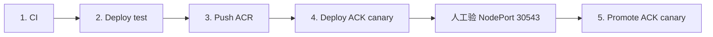
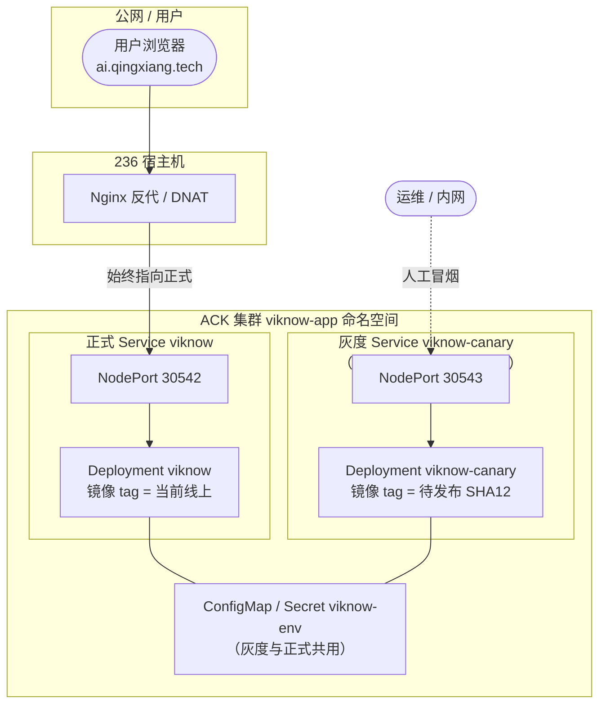
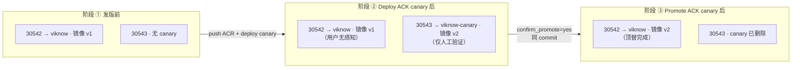
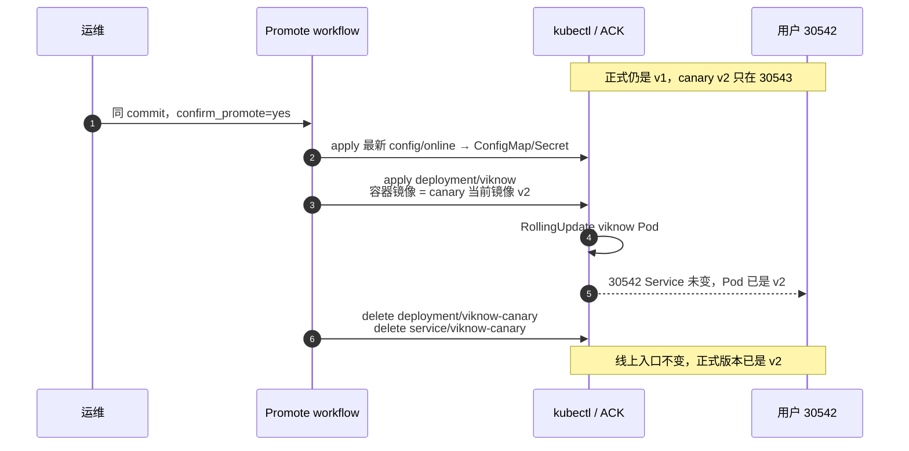
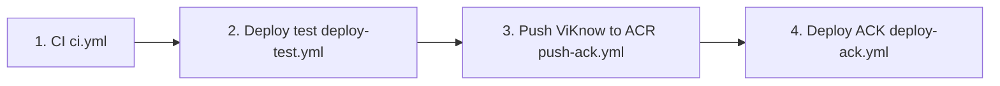

# ViKnow 镜像发布流程（online prod / ACK）

本文整理 **ViKnow 主应用镜像** `viknow2-app` 从代码到 ACK `viknow-app` 命名空间的发布链。事实来源为 Gitea 业务仓 `castmeta-research/viknow2` 的脚本与 `.gitea/workflows`（2026-09 在 236 上核对）。

不包含：Langfuse / Neo4j / ClickHouse 等 **数据栈镜像** 的独立发布（另有 manifest 与 ACR 标签，通常随基础设施变更而非每次应用发版）。

---

## 1. 你要发布的是什么

| 项目 | 说明 |
| --- | --- |
| 镜像名 | `viknow2-app` |
| 本地 tag（runner） | `viknow2-app:<commit_sha 前 12 位>` |
| 推送到 ACR（公网） | `${VIKNOW_ACR_REGISTRY}/${VIKNOW_ACR_NAMESPACE}/viknow2-app:<sha12>` |
| ACK Pod 拉取（VPC） | `${VIKNOW_ACR_PULL_REGISTRY}/${VIKNOW_ACR_NAMESPACE}/viknow2-app:<sha12>` |
| 默认 namespace | `litesense`（与 `deploy/ack/deploy-viknow-app.sh` 默认一致；以 Gitea Variables 为准） |
| 默认 pull 域名 | `registry-vpc.cn-hangzhou.aliyuncs.com` |
| 默认 push 域名 | `registry.cn-hangzhou.aliyuncs.com`（与 ACK 同地域 **cn-hangzhou**） |

Tag **必须** 与本次发布的 **Git commit** 一致（12 位短 SHA）。`scripts/acr_image.py` 统一计算本地/远程镜像名，避免 push 与 deploy 各写一套 tag。

---

## 2. 标准发布链（同一 commit、同一 runner）

所有 ACK 应用发版在 Gitea 上都是 **手动 `workflow_dispatch`**，且依赖 **同一台 runner 上已存在的本地镜像**（`python-312-uv`）。

### 2.1 推荐：灰度再顶替 prod（30543 → 30542）

viknow2 分支 **`agent/ack-canary-promote`**（合并后见 `main`）提供两条额外 workflow：



| 步骤 | Workflow | 作用 |
| --- | --- | --- |
| 1–3 | 同下 | CI → test 构建 → push ACR |
| 4 | **`deploy-ack-canary.yml`** | 部署 `viknow-canary`，**NodePort 30543**；**不改** 30542 正式流量 |
| — | **人工** | 对 ACK 节点 `:30543` 冒烟（236 如需 DNAT 需运维自行加） |
| 5 | **`promote-ack-canary.yml`** | 输入 `confirm_promote=yes`；把 canary 镜像写入 `deployment/viknow`，滚更 **30542**，删除 canary |

步骤 4 与 5 **必须在同一 commit** 上运行（Promote 校验 canary 镜像 tag = SHA 前 12 位）。细节见 viknow2 `docs/deploy-ack-canary-promote.md`。

#### 线上顶替逻辑示意图

公网用户始终走 **236 Nginx → NodePort 30542**；灰度只在 **30543** 上验新版本，**Promote** 才把正式 Deployment 换成新镜像并拆掉 canary。



**三阶段对照（同一 ACK 节点，两个 NodePort）：**



**Promote 在集群里做的事（顶替，不是改 Nginx）：**



| 对象 | 灰度前 | canary 后 | Promote 后 |
| --- | --- | --- | --- |
| 用户入口 | 236 → **30542** | 236 → **30542**（仍 v1） | 236 → **30542**（v2） |
| `deployment/viknow` | v1 | v1 | **v2** |
| `deployment/viknow-canary` | 不存在 | v2 | **已删** |
| NodePort 30543 | 无 | canary 验证 | 无 |

`deploy-ack.yml` 仍保留：**跳过灰度、直接更新 prod**（应急或明确不要灰度时）。

### 2.2 直接 prod（四步）



| 步骤 | Workflow | 作用 |
| --- | --- | --- |
| 1 | `ci.yml` | `ruff` + `pytest` + `uv build` wheel；wheel 存到 runner `/cache/uv/viknow2-artifacts/${GITHUB_SHA}` |
| 2 | `deploy-test.yml` | 用 wheel + `docker buildx bake` 构建 **`viknow2-app:<sha12>`**；部署 test 容器（`:5175`）做冒烟 |
| 3 | `push-ack.yml` | 手动填写 **`app_image_tag`**（runner 上 `viknow2-app:<tag>`，通常 SHA 前 12 位）；分支下拉仅 checkout 脚本 → `push-viknow-acr.sh` push 到 ACR |
| 4 | `deploy-ack.yml` | `scripts/deploy-ack-env.sh` → `deploy/ack/deploy-viknow-app.sh` **kubectl apply** Deployment |

**顺序不能乱、tag 要对：**  
`push-ack` 按输入的 **`app_image_tag`** 找 runner 本地 `viknow2-app:<tag>`（不再绑定分支 HEAD 的 `GITHUB_SHA`）。若本地无该镜像，会报 `Missing local image` 并列出已有 `viknow2-app` tag。Deploy ACK 仍应用 **同一 tag** 与 ACR 一致。

各 workflow 文件头注释与 `.gitea/repository-config.example.yaml` 中「push-ack 手动发布链」一致。

---

## 3. 每一步在做什么（细节）

### 3.1 CI（`ci.yml`）

- 触发：`main` push / PR / 手动。
- 产出：测试通过 + **wheel 缓存**（供下一步构建 Docker，避免重复 `uv sync`）。
- **不会** 构建 `viknow2-app` 镜像，也不会 push ACR。

### 3.2 Deploy test（`deploy-test.yml`）

- 计算 `VIKNOW_APP_IMAGE=viknow2-app:<sha12>`。
- 若 runner 上尚无该镜像：
  - 从 CI 缓存恢复 `dist/*.whl`；
  - `prepare-docker-build-context.py` + `docker buildx bake`（`docker/docker-bake.hcl` 的 `app` target）；
  - 构建结果 **load 进本地 Docker**（`type=docker`）。
- 运行 `scripts/deploy-test-env.sh`，在 test 环境验证（容器名等见 workflow 内 `VIKNOW_TEST_*`）。
- 成功后 runner 上应能 `docker image inspect viknow2-app:<sha12>`。

### 3.3 Push ViKnow to ACR（`push-ack.yml`）

- 校验 Gitea **Variables / Secrets**：`VIKNOW_ACR_REGISTRY`、`VIKNOW_ACR_NAMESPACE`、`VIKNOW_ACR_USERNAME`、`VIKNOW_ACR_PASSWORD`（见 example 配置说明）。
- 调用 `scripts/push-viknow-acr.sh`：`docker login` → `docker tag` → `docker push`。
- ACK 节点侧通常通过 **同地域 VPC 域名 + ACR 免密助手** pull，不要求把 push 密码下发到 Pod。

### 3.4 Deploy ACK（`deploy-ack.yml`）

- 校验 `kubectl`、Variable `VIKNOW_ACR_NAMESPACE`（及可选 `VIKNOW_ACR_PULL_REGISTRY`）。
- `scripts/deploy-ack-env.sh`：
  - `scripts/prepare-online-deploy-env.sh` 从 **236 runner 宿主机** 同步 `config/online/deploy.env`（阿里云 / online 全量配置，**不进 Gitea Secrets**）；
  - `inject-deploy-secrets.py --env online --strict` 仅校验占位符，不从 CI 覆盖；
  - 执行 `deploy/ack/deploy-viknow-app.sh`。
- `deploy-viknow-app.sh`：
  - 用 **VPC pull 域名** 拼镜像 URL，替换 `deploy/ack/viknow-app.yaml` 中的 `__VIKNOW_APP_IMAGE__`；
  - 更新 `viknow-app` 命名空间下 ConfigMap / Secret（来自 **`config/online/`**）；
  - `kubectl apply` + `rollout status deployment/viknow`。

---

## 4. 只改镜像 vs 只改配置

| 场景 | 做法 |
| --- | --- |
| **只发新版本应用** | 走完整四步；镜像 tag 随 commit 变，Deployment 镜像更新 |
| **只改 online 配置/密钥** | 需要更新集群内 ConfigMap/Secret；**不要** 误以为改 `config/online/` 后 push 镜像就会自动生效——`deploy-viknow-app.sh` 会在 deploy 时 apply 这些对象 |
| **ACK 运行时配置以 manifest 为准** | 长期维护也可使用 `deploy/ack/bootstrap-viknow-app-config.sh`，数据源是 **`deploy/ack/runtime/`**（注释写明：与 CI 的 `config/online/` 不是同一条路径；改 runtime 后需 bootstrap，且 **换镜像不会刷新** 已 bootstrap 的配置） |

发版前和平台同学对齐：当前 online 以 **Gitea deploy-ack 链（config/online + inject secrets）** 为准，还是以 **runtime bootstrap** 为准。

---

## 5. 发布前检查清单

1. **目标 commit** 已在 `main`（或团队约定的发布分支），且 **CI 对该 commit 为绿**。
2. Gitea **Variables / Secrets** 已按 `.gitea/repository-config.example.yaml` 配齐（至少 ACR push；**online 业务/阿里云密钥在 236 `config/online/deploy.env`**）。
3. 四步 workflow 均在 **同一 commit** 上触发（Actions 页选对 revision）。
4. `deploy-test` 通过后，在 runner 上逻辑上等价于：本地存在 `viknow2-app:<sha12>`。
5. `push-ack` 日志出现 `Pushed registry.../viknow2-app:<sha12>`。
6. `deploy-ack` 后：`kubectl -n viknow-app rollout status deployment/viknow` 成功；NodePort **30542** 仍指向新 Pod（见 `deploy/ack` 与线上 inventory）。

---

## 6. 常见失败

| 现象 | 原因 | 处理 |
| --- | --- | --- |
| `Missing local image: viknow2-app:…` | 未跑 deploy-test，或 push/deploy 的 commit 与构建不一致 | 从步骤 2 在同一 SHA 重跑 |
| `Missing wheel artifact for …` | 未对该 SHA 跑过 CI | 先跑 CI 再 deploy-test |
| ACR `denied` / login 失败 | `VIKNOW_ACR_*` 凭证或 RAM 权限 | 控制台核对命名空间与固定用户名；见 ops 台账 ACR 探测记录 |
| Pod `ImagePullBackOff` | ACR 未 push 成功，或 tag/namespace 与 Deployment 不一致 | 核对 ACR 仓库是否有 `<sha12>`；核对 `VIKNOW_ACR_NAMESPACE` |
| Pod Running 但行为不对 | 只 push 镜像未 deploy，或 ConfigMap/Secret 仍是旧值 | 跑 deploy-ack 或单独 apply 配置 |

---

## 7. 与公网入口的关系

镜像发布只更新 **ACK 内 `viknow` Service**（NodePort 30542）。当前线上 Web 主路径仍是 **236 Nginx → DNAT → NodePort**（见线上 infrastructure / 架构图）。发版后建议在 236 或 `ai.qingxiang.tech` 做一次 HTTP 冒烟，而不是只盯 ACR push 成功。

---

## 8. 相关文件索引（viknow2 仓）

| 路径 | 用途 |
| --- | --- |
| `.gitea/workflows/ci.yml` | 测试 + wheel |
| `.gitea/workflows/deploy-test.yml` | 构建本地 `viknow2-app:<sha12>` + test 部署 |
| `.gitea/workflows/push-ack.yml` | Push 到 ACR |
| `.gitea/workflows/deploy-ack.yml` | ACK online prod |
| `scripts/push-viknow-acr.sh` | docker login / tag / push |
| `scripts/acr_image.py` | 本地/远程镜像名 |
| `scripts/prepare-online-deploy-env.sh` | 从 runner 同步 online deploy.env |
| `scripts/deploy-ack-env.sh` | 加载 deploy.env + 调用 deploy 脚本 |
| `deploy/ack/deploy-viknow-app.sh` | kubectl apply ViKnow Deployment |
| `deploy/ack/viknow-app.yaml` | Deployment 模板（`__VIKNOW_APP_IMAGE__`） |
| `deploy/ack/bootstrap-viknow-app-config.sh` | 可选：从 `deploy/ack/runtime/` /bootstrap Config |
| `.gitea/repository-config.example.yaml` | Variables/Secrets 说明 |

---

## 9. 手动在 236 上 push（仅应急）

runner 与 236 若共享 Docker 不一定成立；**规范路径仍是 Gitea 四步链**。若必须在有本地镜像的机器上应急 push，可设置与 workflow 相同的环境变量后执行：

```bash
# 在 viknow2 仓库根目录；勿把密码写进 shell history / 提交
export GITHUB_SHA=<full_commit>
export VIKNOW_ACR_REGISTRY=registry.cn-hangzhou.aliyuncs.com
export VIKNOW_ACR_NAMESPACE=litesense
export VIKNOW_ACR_USERNAME=...
export VIKNOW_ACR_PASSWORD=...
bash scripts/push-viknow-acr.sh
```

随后在具备 kubeconfig 的环境执行 `deploy/ack/deploy-viknow-app.sh`（需 `config/online/deploy.env` 与 kubectl 上下文指向 online prod）。

---

## 10. Deploy ACK：怎么做（含人工方案）

**前提（无论哪种方式）：**

1. ACR 里 **已经有** 目标 tag（例如刚 push 的 `viknow2-app:d3f41894eb37`）。
2. 本机 `kubectl` 能连 **ACK `viknow2-online-prod`**（`kubectl get ns` 正常）。  
   - 236 上的 `cursor-agent` **当前没有** `~/.kube/config`，所以 **Gitea Deploy ACK 在 runner 上也会卡住**，除非给 runner 配 kubeconfig。
3. 镜像 URL 在集群内必须用 **VPC 拉取域名**，不是 push 用的公网域名：  
   `registry-vpc.cn-hangzhou.aliyuncs.com/litesense/viknow2-app:<sha12>`

---

### 方案 A：Gitea 点 workflow（推荐，配好 runner 后）

1. 打开 Gitea `castmeta-research/viknow2` → **Actions**。
2. 选中 **与 push 相同 commit** 的分支/修订（例如 `main` @ `d3f41894eb37…`）。
3. 手动运行 **Deploy ACK**（`deploy-ack.yml`）。
4. 看日志：`rollout status deployment/viknow` 成功；`kubectl -n viknow-app get pods`。

Workflow 会执行 `scripts/deploy-ack-env.sh`：`prepare-online-deploy-env.sh` 从 **236 runner** 同步 `config/online/deploy.env`（DB/OSS/Redis/模型 API 等），再跑 `deploy-viknow-app.sh`。

**需要平台预先配好：** Gitea Variables（`VIKNOW_ACR_NAMESPACE`、`VIKNOW_ACR_PULL_REGISTRY`）+ runner 上维护的 **`config/online/deploy.env`** + **kubectl/kubeconfig**（可选 Secret `VIKNOW_ACK_KUBECONFIG`）。

---

### 方案 B：运维机手工跑脚本（与 workflow 等价）

在一台 **已有 kubeconfig** 的机器上（可以是你的笔记本 VPN 进 VPC，或带 ACK 访问的跳板机，**不要**把 kubeconfig 提交进 git）：

```bash
cd /path/to/viknow2
git fetch && git checkout <要发布的 commit>   # tag 与 GITHUB_SHA 前 12 位一致

export KUBECONFIG=/path/to/ack-viknow2-online-prod.kubeconfig.yaml
export GITHUB_SHA=$(git rev-parse HEAD)          # 完整 40 位或至少 12 位前缀一致
export VIKNOW_ACR_PULL_REGISTRY=registry-vpc.cn-hangzhou.aliyuncs.com
export VIKNOW_ACR_NAMESPACE=litesense

# 方式 1：与 deploy-ack.yml 相同（236 runner 上已有 config/online/deploy.env）
bash scripts/prepare-online-deploy-env.sh
bash deploy/ack/deploy-viknow-app.sh

# 方式 2：若 deploy.env 在其它路径
export VIKNOW_ONLINE_DEPLOY_ENV_HOST=/path/to/config/online/deploy.env
bash scripts/prepare-online-deploy-env.sh
bash deploy/ack/deploy-viknow-app.sh
```

脚本会：更新 `viknow-app` 命名空间下 ConfigMap/Secret（来自 **`config/online/`**），并把 Deployment 镜像设为 VPC 地址的 `viknow2-app:<sha12>`。

**只换镜像、不改 YAML 配置** 时，inventory 也允许直接跑 `deploy-viknow-app.sh`（不必跑 bootstrap）。  
若改的是 **`deploy/ack/runtime/`** 那套 ACK 真源配置，应改用 `bash deploy/ack/bootstrap-viknow-app-config.sh`，与 `deploy-viknow-app.sh` 不是同一条路径。

---

### 方案 C：只滚镜像（最简人工，不动 ConfigMap/Secret）

确认 **Secret/Config 已是线上正确版本**，只需换 tag 时：

```bash
export KUBECONFIG=/path/to/ack.kubeconfig.yaml
TAG=d3f41894eb37   # 与 ACR 中 tag 一致
IMG=registry-vpc.cn-hangzhou.aliyuncs.com/litesense/viknow2-app:${TAG}

kubectl -n viknow-app set image deployment/viknow viknow="${IMG}"
kubectl -n viknow-app rollout status deployment/viknow --timeout=900s
kubectl -n viknow-app get pods,svc -l app=viknow
```

容器名 `viknow` 来自 `deploy/ack/viknow-app.yaml`。  
Service 须保持 **NodePort 30542**（现网 236 Nginx → DNAT 依赖此端口）。

---

### 方案 D：阿里云控制台（纯人工，易错）

ACK 控制台 → 集群 `viknow2-online-prod` → 工作负载 → 命名空间 `viknow-app` → Deployment `viknow` → 编辑容器镜像，填 **VPC 镜像地址**（同上 `registry-vpc…/viknow2-app:<sha12>`），保存并等待滚动更新。

缺点：容易填成公网 registry 或错 tag；不会同步更新 ConfigMap/Secret。

---

### 发布后怎么验

```bash
kubectl -n viknow-app rollout status deployment/viknow
kubectl -n viknow-app get pods -l app=viknow -o wide
kubectl -n viknow-app describe pod -l app=viknow | tail -30   # ImagePullBackOff 时看 Events
```

集群外：236 Nginx / `http://ai.qingxiang.tech` 或 `:8088` 冒烟（与 inventory 一致）。

---

### 常见卡点

| 问题 | 处理 |
| --- | --- |
| `current-context is not set` | 设置 `KUBECONFIG` 或 `kubectl config use-context` |
| `Missing config/online/deploy.env` | 用 `deploy.env.example` + 填密钥，或跑 `deploy-ack-env.sh` 前半段 |
| `ImagePullBackOff` | 确认 ACR 有该 tag；Deployment 里是 **registry-vpc** 不是公网 registry |
| Pod Running 但业务不对 | 可能只滚了镜像但 Secret 旧；对比 `viknow-env` / 是否应跑 bootstrap |
